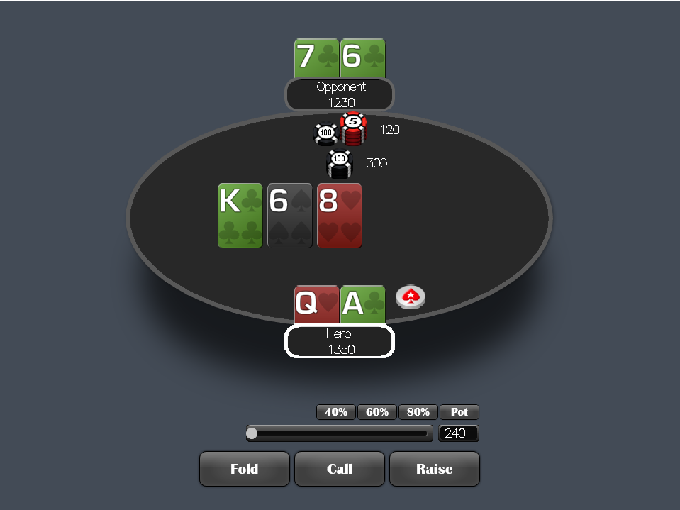

# Λambd'em Poker

## Description
Client for playing Texas Hold`em versus AI or human beings with some additional features, possibly. \
Full initial project description can be read [here](/docs/description.md).

List of implemented features:
- table
- player seats
- dealing cards
- posting blinds
- bet display in chips
- time delayed actions
- bottom & up seatbolds
- *another not really cool stuff*

~~Link to huge haddocs here, although no one will really read them...~~

## Status

One phrase review: \
*Do or die trying.*

Nothing really playable here yet,
but you can at least get some cards.

Developing ...

## Build and run

Just installed [Stack](https://www.haskellstack.org)?

Then:

`stack setup`

For normal run:

`stack build && stack exec poker`
