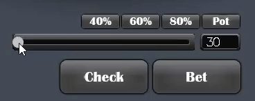

# Λambd'em Poker

## Description
Client for playing Texas Hold 'em versus AI or human beings with some additional features, possibly.

*Feel uncomfortable if you don't know/remember game rules?* \
Be prepared, read 'em [all](docs/game%20rules.md) or tl; dr & look at pictures.

## Features


### Layout

- table (with shadow! ~~It's important~~)
- player seats that display name & balance
- quasar deck layout (from One Site Which Must Not Be Named)
- chips layout (from the same source that deck)
- action buttons, small bet sizing buttons and slider (finally, original)

### UX



- slider to choose bet with big blind step
- small buttons to choose bet in % of current pot
- only possible actions are suggested for buttons
- fold is blocked when check is available


- active player is highlighted
- game results are showed when one player is left
- AI think time is 1s
- showdown is showed only for 2.44s, don't miss it!
- clicked action button is faded

### Logic

- dealing random cards and board
- posting blinds
- change of positions
- handling of bet rounds
- detecting & comparing of poker combinations
- detecting winner(-s) and awarding them

### AI

- 5 predefined play styles: telephone, passive, loose, tight and aggresive
- chooses move on pre-flop depending on hand range and size of incoming bet
- has probabilities of performing some move relying on chance and combination strength
- considerates random distribution for choosing bet size
- can use continuation bets up to triple barrel bluff on air

## Status

Solid release candidate is made, although some bugs are sneaking nearby and deep inside you still think that some shizzle sugar stuff like move timer or highlighting of winner is critically essential.

Play to your heart content versus AI or at least try winning all of them. Just remember, none of them ever pretends to be hazardous entity and still requires at least twice as much work as was done to be reborn in *Serious Strategy Unit* ©.

## Build and run

First of all - install [Stack](https://www.haskellstack.org) tool.

Setup it on first launch:

`stack setup`

For launching client:

`stack build && stack exec poker`

Use command line argument to explicitly set opponent play style:

`stack exec poker %playstylename%`

Available options:

- `telephone`
- `passive`
- `loose`
- `tight`
- `aggresive`
- `random`

When choosing `random` play style, one of previous 5 is chosen fortuitously. Also, it's default setting for missing, misspelled or multiply argument.

Disregard that, [Cabal](https://www.haskell.org/cabal/) is fine too.

```
cabal install --only-dependencies
cabal run %playstylename%
```

## Documentation

Initial project requirements document can be read [here](docs/description.md).
And for brave ones, feel free to look through haddock documentation, it's offline version is located in `docs/lambdem-poker-0.6`.

## Additional stuff

As part of project web based range selector is supplemented.


~~Wait, what?! That peasant front end?! In my cozy haskell project?!~~

## Testing

Contains some hand templates to test detecting and comparing of combinations.
Isn't pretending to be a test coverage at all and still requires a human eye
to verify results. Consider it like sandboxed appendage for debugging purposes.

For launching tests use:

`stack test`

*Don't even try to run if you don't know what you're exactly doing!*
