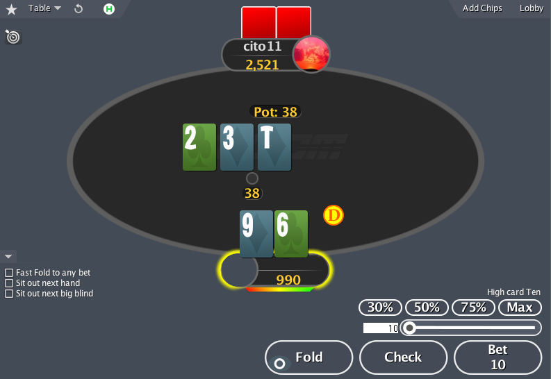

# Λambd'em Poker

## Описание

В данном задании предполагается реализация клиента для игры в покер. В зависимости от количества функционала конечная реализация может иметь такой вид (по увеличению степени запущенности):

## Минимальные требования (базовая часть)

Базовая реализация должна:

- предоставлять возможность игры HU (Heads-Up, 1 vs 1):
  - человек против человека
  - игра - техасский холдем
  - тип игры - cash
  - тип ставок - NL (No-Limit)
- иметь простенький графический интерфейс, включающий в себя:
  - игровой стол
  - layout для карт
  - кнопки действий (check/call, fold, bet/raise)
  - ползунок выбора ставки
  - отображение ставок игроков
  - отображение банка
  - отображение фишки дилера
- вести обработку действий игроков:
  - на всех возможных улицах торгов (pre-flop, flop, turn, river)
  - предлагать для выбора только корректные действия
- иметь следующие игровые механики:
  - определять и уметь сравнивать покерные комбинации при вскрытии
  - правильно делить итоговый банк в зависимости от вложенных долей
  - проводить смену блайндов
  
## Расширение игровых возможностей клиента (индивидуальная часть)

- дополнительные типы ставок - FL/PL (Fix-Limit, Pot-Limit)
- анте
- дополнительные режимы игры:
  - SnG (Sit & Go)
  - MTT (Multi Table Tournament)
- другие игры:
  - omaha
  - draw
  - etc
- предоставлять возможность настройки игровой сессии:
  - стеки игроков
  - размер блайндов
- смена layout-ов карт/стола
- настройка кнопок/ползунка

## Расширение околоигрового функционала клиента (индивидуальная часть)

- работа с логами игровой сессии:
  - запись истории рук
  - просмотр истории рук
  - сохранение/загрузка сессии
- подсчет и работа с игровой статистикой:
  - учёт статистик действий игроков (VPIP, PFR, 3bet, AF и многие другие)
  - учёт диапазонов
  - выведение статистик на экран в виде HUD
  - построение графиков игрового процесса (Total/SD/non-SD/EV winnings)
- подсчет различных игровых параметров:
  - вероятностей комбинаций
  - шансов при выставлениях
  - EV
  - ITM/ICM
  - SPR

*Примечание: для учёта логов и/или статистик имеет смысл задуматься об
использовании той или иной базы данных, однако это не обязательно*

## Расширение поддерживаемого количества игроков (индивидуальная часть)

- вплоть до 6 max
- вплоть до 9 max
- одновременной многостоловой игры для турниров

## Искусственный интеллект (индивидуальная часть)
Для реализации так или иначе потребуется солидная
часть из *Расширение околоигрового функционала клиента*.

- простые алгоритмы
  - принимают решения на основе заданной заранее стратегии
  - используют несколько простых эвристик (диапазоны открытия, AFq, вес 
  собранной комбинации)
- улучшенные простые алгоритмы
  - вариации меняющихся простых алгоритмов
  - большее число эвристик
- продвинутые алгоритмы
  - использование истории раздач для подсчета весов
  - смена весов в зависимости от игры оппонента
  
*Примечание: продвинутые алгоритмы в виду их сложности имеет смысл делать
только для HU режима, тогда вероятность получить что-то играбельное
значительно повышается.*

## Клиент-серверная архитектура (индивидуальная часть)

Предоставление возможности игры с реальными оппонентами хотя бы
в пределах локальной сети.
